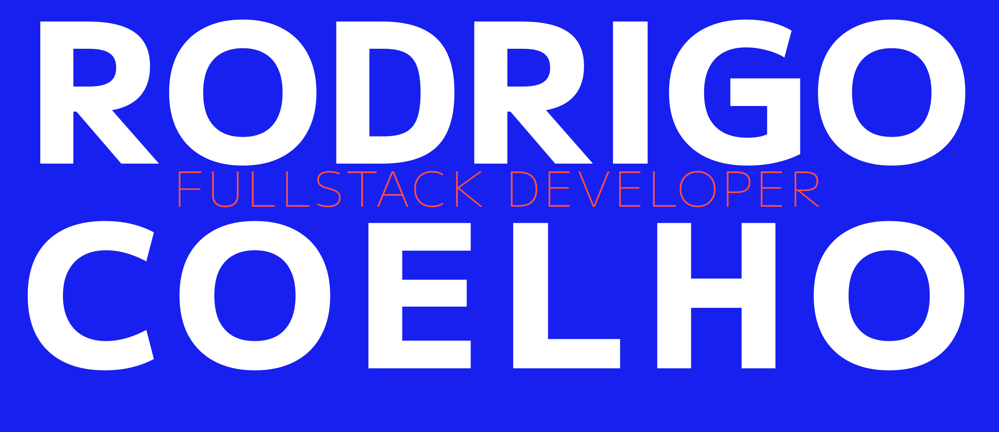

<h2>Hey there! I'm Rodrigo Coelho</h2>
<h3 align="left">Full-Stack Developer with extensive experience as a front-end and web designer, with a degree in Technology and Communication. I have experience in various projects. The ability to quickly learn and apply new technologies is one of my strongest assets. A degree and an intensive bootcamp taught me the importance of priorities and teamwork. I am a diligent, creative, and curious professional who always enjoys learning more. I have a positive approach and enjoy challenges that allow me to enhance my skills.</h3>

### 👨🏻‍💻 &nbsp;About Me

💡 &nbsp;I find joy in experimenting with new technologies and creating software solutions with creativity.\
🎓 &nbsp;Bachelor's degree in Multimedia and Communication Technologies at the University of Aveiro, 2023.\
🎓 &nbsp;Bootcamp in Full Stack and Web Development at the Le Wagon.\
✍️ &nbsp;Among my hobbies/side hustles are Web Design, Illustrations and Concept Art.\
💬 &nbsp;Ask me about my projects, coding adventures, or anything tech-related! I'm here to share knowledge and discuss exciting ideas.\
📄 &nbsp;Please have a look at my [Résumé](https://i.ibb.co/Wvb9PVB/CV-Rodrigo-Coelho-compactado.jpg) and my  [Portfolio](https://i.ibb.co/mH3bX9L/portfolio-compactado.jpg)  for more details about me. I'm open to feedback and suggestions!

### 🛠 &nbsp;Tech Stack

### ⚙️ &nbsp;GitHub Analytics

&nbsp;

### 🤝🏻 &nbsp;Connect with Me

